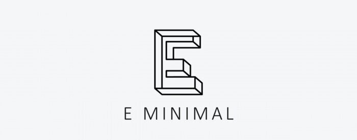
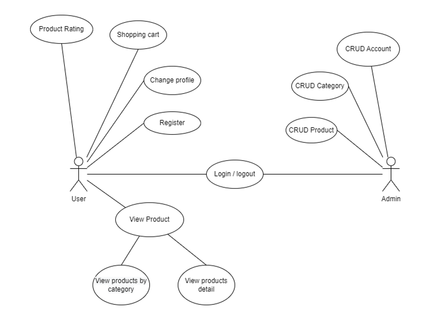
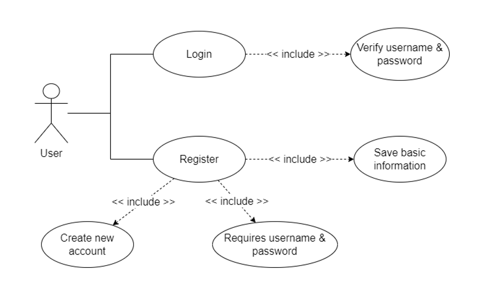
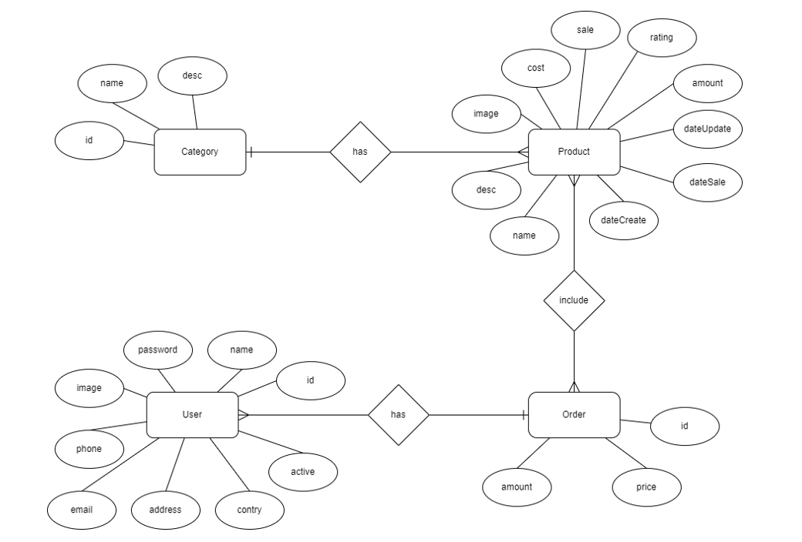
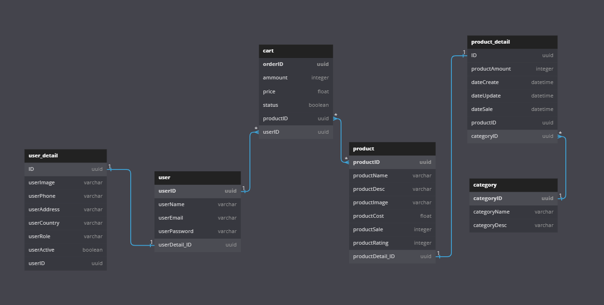

<h1 align="center">eMinimal - shopping website</h1>

## Giới thiệu

> - eMinimal là một trang web mua sắm nội thất được thiết kế bằng ReactJS và dựa trên các mẫu có sẵn trên [dribble](https://dribbble.com/).
> - Các mẫu thiết kế có sử dụng đều được đặt trong [đây](./assets/images/template).

## Công nghệ sử dụng

> - [ReactJS](https://reactjs.org/) - Một thư viện JavaScript dùng để xây dựng giao diện người dùng
> - [Spring Boot](https://spring.io/projects/spring-boot) - Một framework Java dùng để xây dựng RESTful API
> - [PostgreSQL](https://www.postgresql.org/) - Một hệ quản trị cơ sở dữ liệu quan hệ
> - [Docker](https://www.docker.com/) - Một công cụ để đóng gói và chạy ứng dụng

## Mô hình thiết kế

> - Usecase tổng quát

> - Usecase đăng nhập

> - ERD Diagram

> - Database Diagram

